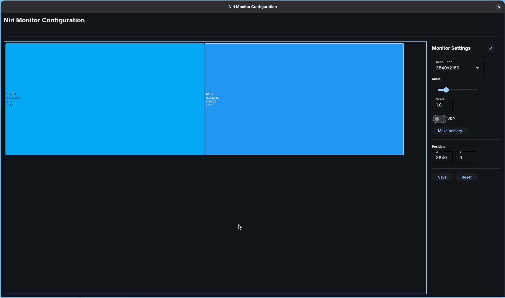

Niricfg
=======

Niricfg is a GUI for configuring niri outputs. It will generate a config file named `~/.config/niri/monitors.kdl` with your monitor configuration which you can [include](https://github.com/niri-wm/niri/wiki/Configuration:-Include) in your main configuration. It was built to provide the atomic variant of the [Arkēs](https://arkes.eeems.codes/) distribution with an application to configure the monitors without requiring users to edit a configuration file.

