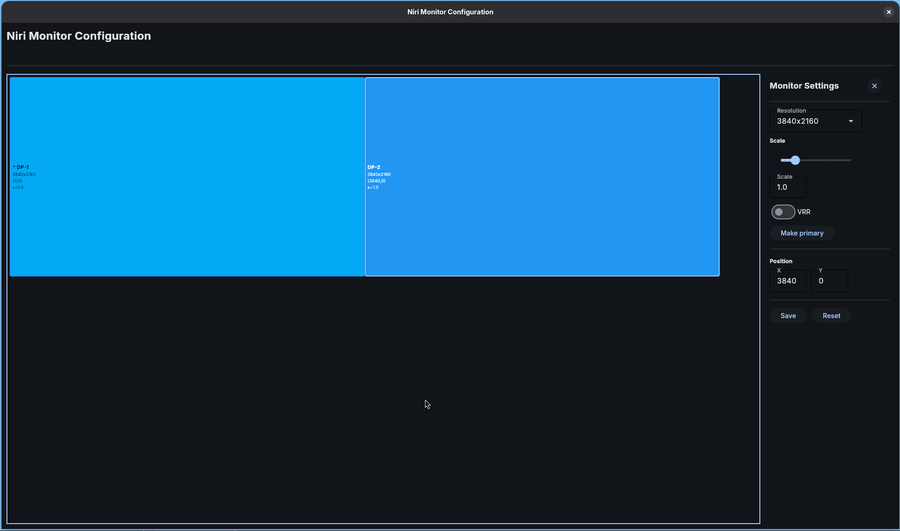

Niricfg
=======

Niricfg is a GUI for configuring niri outputs and animations. It will generate a config file named `~/.config/niri/monitors.kdl` with your monitor configuration, and a config file named `~/.config/niri/animations.kdl`, which you can [include](https://github.com/niri-wm/niri/wiki/Configuration:-Include) in your main configuration. It was built to provide the atomic variant of the [Arkēs](https://arkes.eeems.codes/) distribution with an application to configure the monitors without requiring users to edit a configuration file.

Animations can be placed in `~/.config/niri/animations/<animation>/<name>.kdl` to be selected by the UI. For system packages, you can instead place them in `/usr/share/niri/animations/<animation>/<name>.kdl`.

